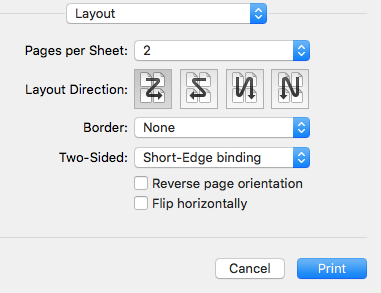

# PDF Booklet

macOS command line utility to reorder pages in a PDF file for booklet printing.

pdfbooklet copies pages from a pdf file to a new pdf file in an order appropriate for booklet 
printing. If the number of pages in the input file is not a multiple of 4, empty pages get inserted.
The inserted pages have the same size as the first page.

Order of pages in the output:

- last page
- first page
- second page
- second-last page
- third-last page
- third page
- fourth page
- ...

Print layout settings to use for the newly created PDF:

- Pages per Sheet: 2
- Layout direction: 1st option (looks like a Z) or 3rd option (looks like mirrored N)
- Two-Sided: Short-Edge binding



## Runtime Requirements

OS X 10.9 (Mavericks), OS X 10.10 (Yosemite), OS X 10.11 (El Capitan), or macOS 10.12 (Sierra), macOS 13.x (Ventura), macOS 15.x (Sequoia).

## Install via [Homebrew](http://brew.sh)

You can simply install it by executing:

		brew install sptim/formulae/pdfbooklet

## Build and Install from Source

There are no extra requirements except Xcode. To build from command line simply run `xcodebuild` in the project root folder.

## Build and Install from Source with Xcode (IDE)

(Tested with macOS 15.1.1 Sequoia with Xcode 16.0)

1. open `pdfbooklet.xcproject` with Xcode
2. Compile with `Product > Build`
3. Export executable with: `Product > Archive` Then, `Distribute Content > Custom, Next. Built Products, Next. Export As` and choose a target folder.
4. Install with: `% cp [WHER-YOU-SAVED-YOUR-APP]/Products/usr/local/bin/pdfbooklet  /usr/local/bin`
5. Test run it with:
```
% pdfbooklet
Usage: pdfbooklet <inputfile> <outputfile>
PDF Booklet Version 1.0.1
```

### Problem Solution

Problem:
- clang: error: SDK does not contain 'libarclite' at the path '/Applications/Xcode.app/Contents/Developer/Toolchains/XcodeDefault.xctoolchain/usr/lib/arc/libarclite_macosx.a'; try increasing the minimum deployment target then: increasing the minimum deployment target

Soltion:
- increasing the minimum deployment target within Xcode. Select your project in the file list on the left (pdfbooklet), select TARGET pdfbooklet, Minimum Deployment 11.5 (or whatever).


## Installation steps:

- Copy the `pdfbooklet` executable to /usr/local/bin/
- Copy the `pdfbooklet.1` man page to /usr/local/share/man/man1/

Alternatively you can also invoke `xcodebuild install DSTROOT=/` to build and install the executable in one step. This does not install the man page.
